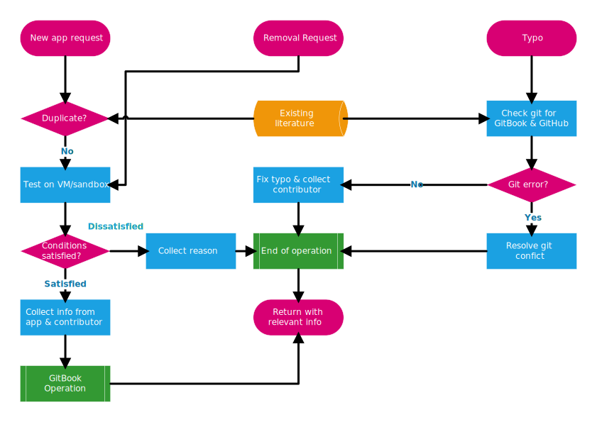

## Workflow

---

Here is basic workflow for this repository:

The chart above is created by Visio 2016. The source file is available [here](https://1drv.ms/u/s!AizihDl7_k2KkwtgtqJk94n5C8Sd)

#### Issues

When a new issue is created, pls label it `pending`;

When you getting start with it, pls remove the `pending` label and re-label it `accepted`;

When it is done, pls pls remove the `accepted` label and re-label it `done`.
