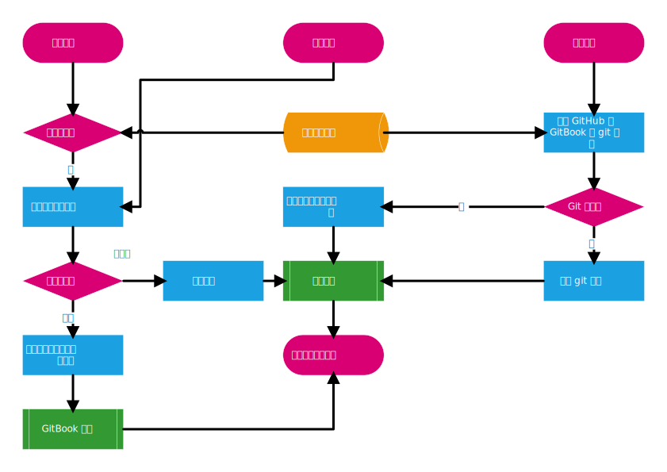

## 工作流程

---

此处展示本项目基本工作流程：

以上图表使用 Visio 2016 创建，源文件位于[此处](https://1drv.ms/u/s!AizihDl7_k2KkwzYSc-W30bSnXo5)

#### Issues

当新 issue 被创建时，请添加 pending 标签；

当某个 issue 开始处理时，请移除 pending 标签并添加 accepted 标签；

当某个 issue 完成时，请移除 accepted 标签并添加 done 标签
